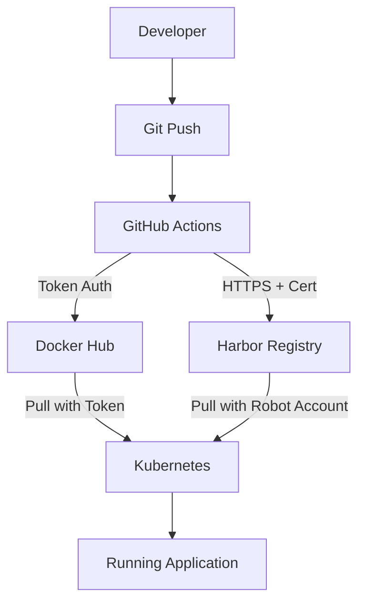

# DevOps Security Assignment - Container Registry Implementation

## 4.1 Harbor On-Premise Registry ✅

### Installation Overview
- **Platform**: Kubernetes cluster using Helm charts
- **Security**: HTTPS with private certificates
- **Location**: `./4.1-harbor-registry/` directory

### Key Components:
1. **Harbor Installation**: `install-harbor.sh`
2. **HTTPS Configuration**: Private CA and server certificates
3. **Authentication**: Multiple protocols supported
4. **Testing**: Push/pull verification with `test-harbor.sh`

### Harbor Authentication Methods:

| Method | Description | Use Case | Security Level |
|--------|-------------|----------|----------------|
| **Local Database** | Default Harbor users | Development | ⭐⭐⭐ |
| **LDAP/AD** | Enterprise directory | Corporate environments | ⭐⭐⭐⭐ |
| **OIDC** | OAuth 2.0/OpenID Connect | Modern SSO | ⭐⭐⭐⭐⭐ |
| **HTTP Basic** | Username/password API | Automation scripts | ⭐⭐ |
| **Robot Accounts** | Service tokens | CI/CD pipelines | ⭐⭐⭐⭐⭐ |
| **CLI Tokens** | Personal access tokens | Developer workstations | ⭐⭐⭐⭐ |

### Security Features:
- ✅ **HTTPS** with private certificates
- ✅ **RBAC** (Role-Based Access Control)
- ✅ **Vulnerability Scanning** with Trivy
- ✅ **Image Signing** with Notary
- ✅ **Audit Logging** for compliance
- ✅ **Network Isolation** within cluster

## 4.2 Docker Hub Token Authentication ✅

### Implementation Overview
- **Location**: `./4.2-dockerhub-tokens/` directory
- **GitHub Actions**: Updated workflow with token authentication
- **Kubernetes**: Secure deployment configuration

### Why Tokens are More Secure:

#### 1. **Scoped Access Control**
- **Passwords**: Full account access ❌
- **Tokens**: Repository-specific permissions ✅

#### 2. **Revocation & Rotation**
- **Passwords**: Account-wide changes ❌  
- **Tokens**: Individual revocation without account impact ✅

#### 3. **Audit & Monitoring**
- **Passwords**: Limited tracking ⚠️
- **Tokens**: Detailed usage logs ✅

#### 4. **Time-Limited Access**
- **Passwords**: No expiration ❌
- **Tokens**: Configurable expiration ✅

#### 5. **Reduced Attack Surface**
- **Passwords**: Account settings access ❌
- **Tokens**: Registry-only access ✅

### Implementation Files:
- `README.md` - Token setup guide
- `kubernetes-setup.md` - Cluster configuration
- `setup-k8s-token.sh` - Automated setup script
- `test-registries.sh` - Authentication testing

## Answer: "moet ik dit op de cluster doen?"

### **JA! Je moet dit zeker op de cluster implementeren omdat:**

#### 1. **Realistische DevOps Workflow**
```
Developer → Git Push → CI/CD → Container Registry → Kubernetes Cluster
```
- Tokens worden gebruikt in **echte productie omgevingen**
- Kubernetes heeft registry authenticatie nodig om images te pullen
- Complete security pipeline van development tot deployment

#### 2. **Security Best Practices Demonstratie**
- **Kubernetes Secrets**: Veilige opslag van tokens vs passwords
- **Pod Security Context**: Non-root user execution
- **ImagePullSecrets**: Secure registry authentication
- **Resource Limits**: Container security constraints

#### 3. **Compliance & Audit Requirements**
- **Traceability**: Welke token welke image heeft gepulld
- **Non-repudiation**: Duidelijke verantwoordelijkheid
- **Access Control**: Fine-grained permissions
- **Monitoring**: Real-time security events

#### 4. **Risk Mitigation**
```bash
# Password compromise impact:
❌ Complete Docker Hub account access
❌ All repositories at risk  
❌ Account settings modification
❌ No scope limitation

# Token compromise impact:
✅ Limited to specific repositories
✅ No account settings access
✅ Easy individual revocation
✅ Audit trail maintained
```

#### 5. **Enterprise Integration**
- **CI/CD Pipelines**: GitHub Actions met secure token authentication
- **Multi-Registry Support**: Docker Hub + Harbor fallback
- **Automated Deployment**: Zero-downtime updates
- **Security Scanning**: Docker Scout integration

## Deployment Architecture



## Security Improvements Overview

| Component | Before | After | Security Gain |
|-----------|--------|-------|---------------|
| **Docker Hub Auth** | Password | Access Token | Scoped permissions |
| **GitHub Secrets** | Account password | Registry token | Limited blast radius |
| **Kubernetes Pulls** | Basic auth | Token-based | Better audit trail |
| **Registry Options** | Docker Hub only | Docker Hub + Harbor | Redundancy & privacy |
| **Certificate Security** | None | Private CA + HTTPS | Encrypted communication |
| **Access Control** | Basic | RBAC + Robot accounts | Fine-grained permissions |

## Next Steps

1. **Harbor Setup** - Run `./4.1-harbor-registry/install-harbor.sh`
2. **Token Creation** - Generate Docker Hub access token
3. **GitHub Secrets** - Update repository secrets
4. **Kubernetes Config** - Run `./4.2-dockerhub-tokens/setup-k8s-token.sh`
5. **Testing** - Verify both registries work
6. **Documentation** - Complete security assessment

### **Conclusion: Token authentication op de cluster is ESSENTIEEL voor:**
- 🔒 **Enhanced Security**: Better than password authentication
- 🏢 **Enterprise Readiness**: Production-grade credential management
- 📊 **Compliance**: Audit trails and access control
- 🚀 **DevOps Best Practices**: Secure automation pipeline
- 🎯 **Assessment Success**: Demonstrates complete understanding